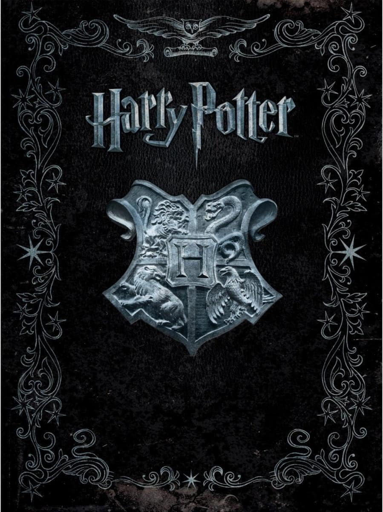

# README

## Descripción
Este proyecto consiste en hacer un programa que devuelva aleatoriamente un personaje de Harry Potter con ciertos valores: 
+ El nombre del personaje.
+ Alguno de sus diálogos.
+ Un Hechizo aleatorio.

Si el hechizo es un Avada Kedavra aparece un mensaje especial.

Se utilizara Git Bash para llevar un control y subir remotamente el archivo a GitHub.

## Tecnologías
+ JavaScript
+ Git Bash
+ GitHub

## Colaboradores
1. You know who.

